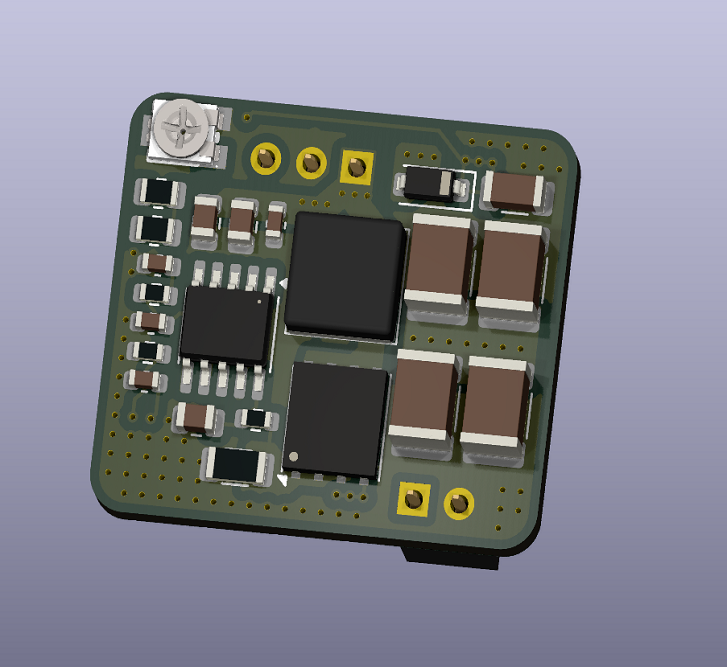
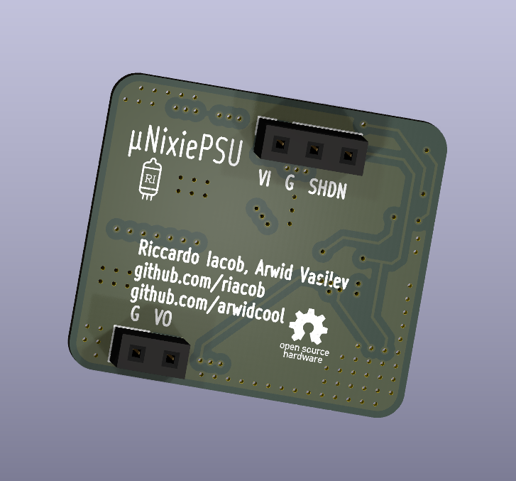

# uNixiePSU
OSHW, compact, flyback-based, nixie tube power supply\
Adjustable output from 160V to 185V, 50mA\
Size: 25x22mm 3 layer board\
Cost: standardized components, reduced cost \
Efficiency: TBD\
Noise: TBD

# Contributors
[Arwid Vasilev](github.com/arwidcool)
- Co-designer

# Gallery

